# Real_time_weather_data_analytics
This is a data engineering project executed using Azure cloud services. The main objective was to create a real time data monitoring, transformation and analytics pipline.

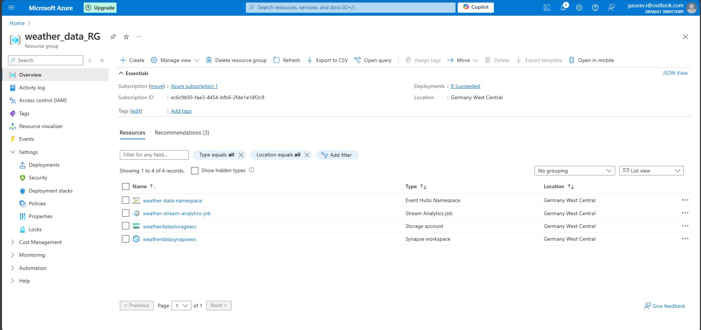

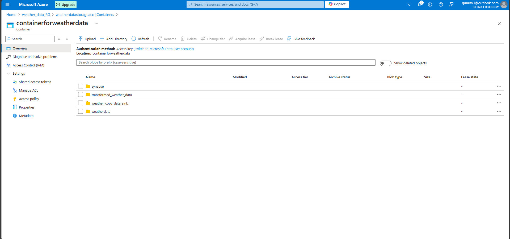

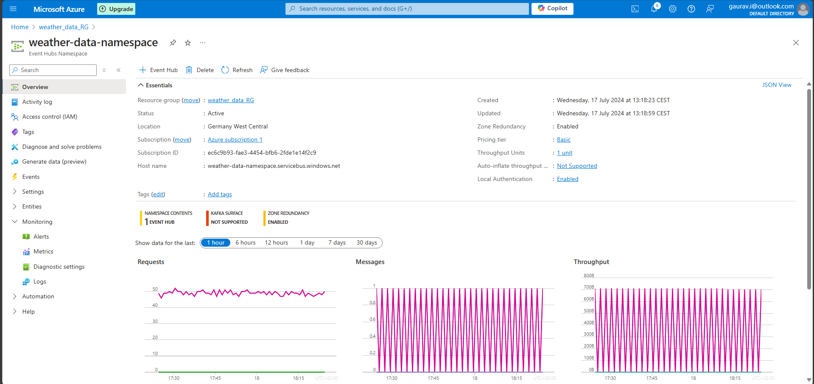

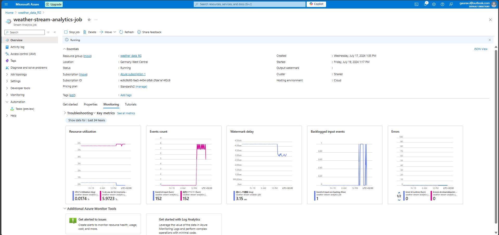

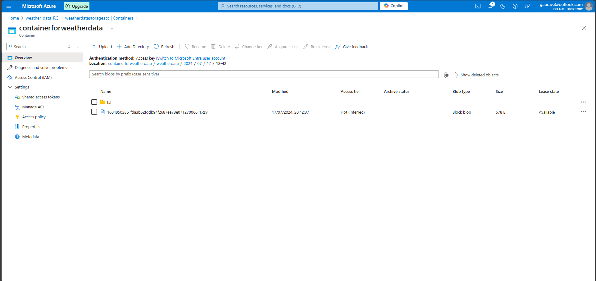

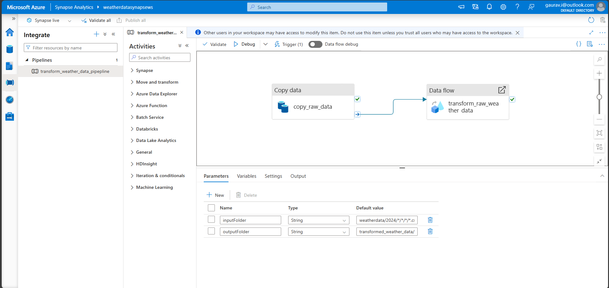

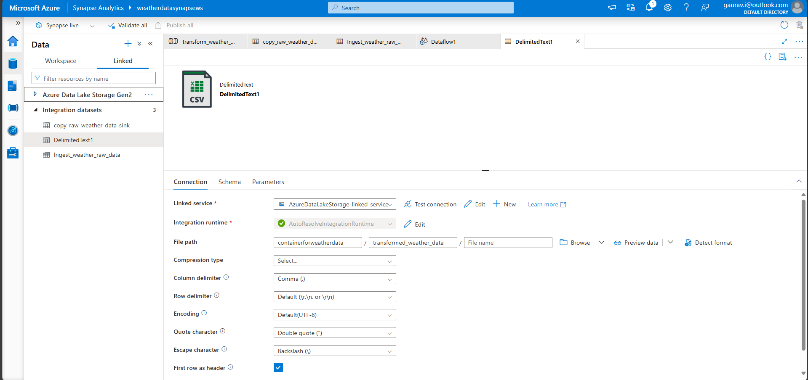

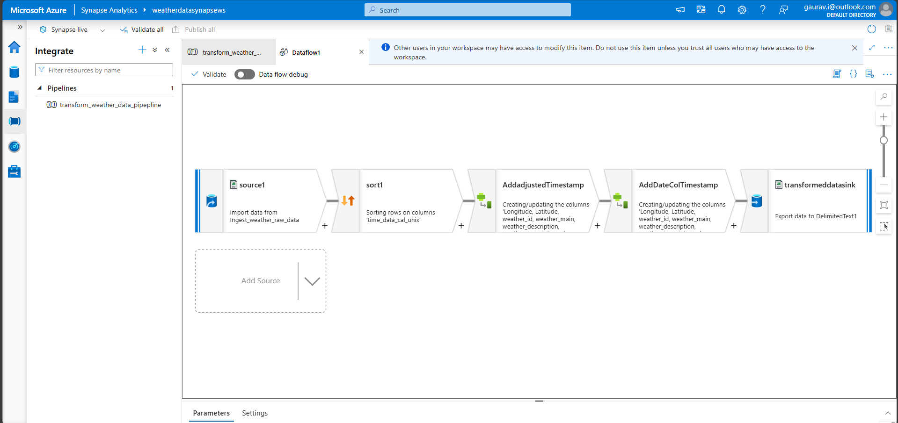

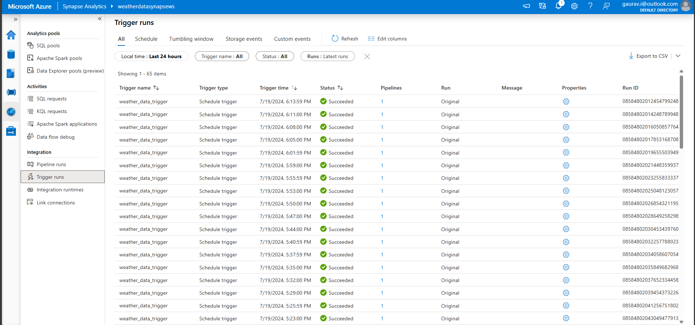

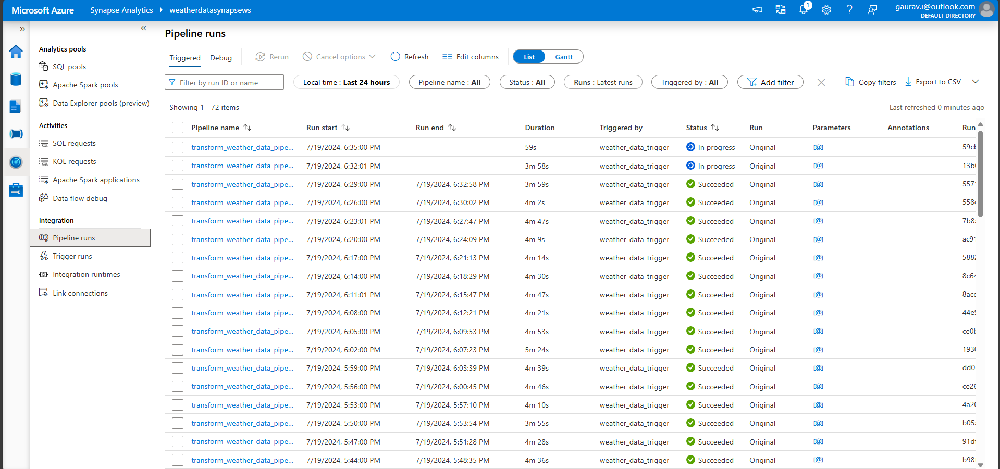

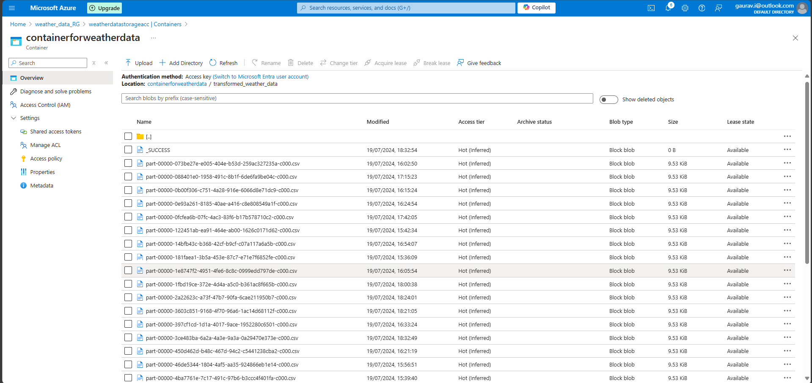

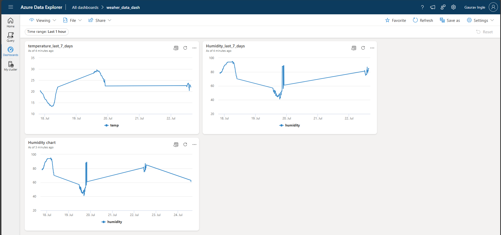
